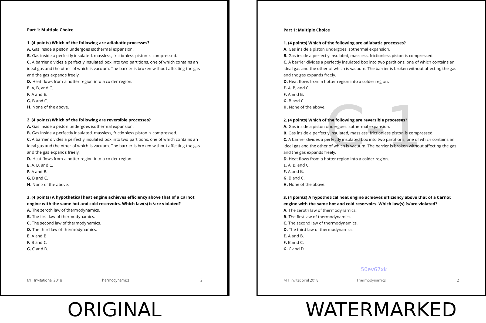

# SciOlyInvitationalWatermark

This script automates the process of watermarking tests with an individual team number and code to discourage test sharing and trading after Science Olympiad Invitational events. This makes it easy to uniquely watermark large numbers of exams and documents for release.

### Requirements

This module is designed to work on Linux/Unix environments. If you are on Windows, Windows Subsystem for Linux may work, but has not been reliably tested.

In additional, this module requires Python 2.7+ and the `matplotlib` plotting library. It requires the following command line tools to be installed:
* pdftk
* imagemagick
* apache2-utils (only if using the htaccess feature)

To test that the script is functioning properly, run `python watermark.py 3 watermarked_tests --test_directory example_tests`, and compare the documents in the `watermarked_tests` folder with the documents in the `example_watermarks` folder.

### Purpose and Function

This script will automatically create copies of tests which are watermarked with the team number and an individualized team code, as illustrated in the example below.

The team number is added to the center of every page with a default transparency of 0.15. An alphanumeric code, unique to each team, is also added in the center bottom of the page. Finally, the pdf is rasterized so that the watermarks cannot easily be removed without the manual excision of the marked areas.

If a test is found circulating before the tournament directors have authorized public release, the watermark can be used to determine which school improperly shared their copy. In addition, the alphanumeric code for each school prevents schools from forging the watermark of other teams, as the correct code for each school is known only to that school and the tournament directors.

This script automatically generates a file hierarchy, where each team's exams are stored in a separate folder labeled with their team number. In addition, this script can also be configured to autogenerate `.htaccess` files for use with Apache server hosting to directly published the directory as a static resource, with team access controlled by HTML Basic Authentication. To generate these files, you must fill in `PATH_TO_STATIC` at the top of the script with the location of the directory within your server filesystem and enable the `--create_htaccess` flag when running the script.

### Usage

Collect all tests to be watermarked into a single flat directory before running the script. This script only supports PDF documents: any documents not in PDF format will be ignored.

`python watermark.py n_teams output_directory[--test_directory test_directory] [--create_htaccess]

See also `python watermark.py -h`

**IMPORTANT:**  This script generates a file `team_data.csv`, which is a table containing the `.htaccess` password and secret code for each team. *This file should not be shared publicly.* It is intended for the use of the tournament directors only in determining the authenticity of a watermark and controlling access to the tests.

### Customization

Several opportunities for customization and optimization are available through editing `watermark.py`. Look for comments starting with `#NOTE`.

For best performance, adjust the number of threads used to write watermarks in `N_THREADS`.

Because the pdfs must be rasterized, there is an inherent tradeoff between the size of the generated files and their quality, which is controlled by the `DENSITY` parameter in the script. A higher density will give higher quality, but will greatly increase the file size, especially for a long, text-heavy exam. The default value of 150 yields generally good performance, but for detailed figures one may want to increase this value to as much as 225.

